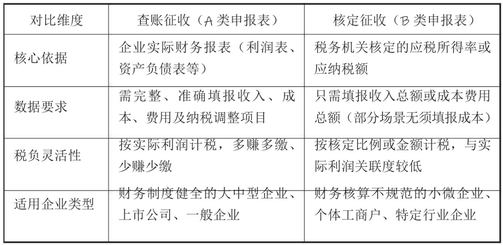
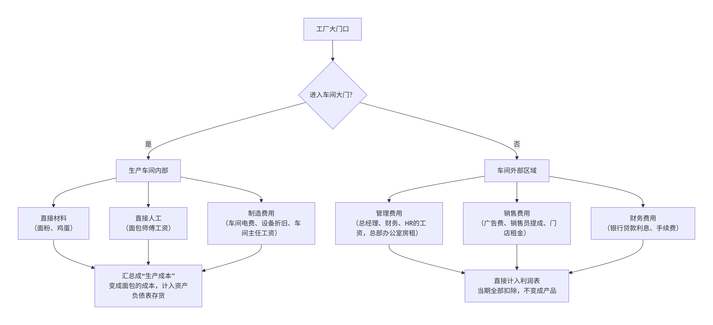

# Accountant

# 1 创建企业

## 1.1 营业执照办理

### 1.1.1 办理流程

1. 咨询领表
2. 核准公司名称
3. 租办公场地：企业一定要清楚当地对办公场地的要求
4. 指定公司章程
5. 递交资料
   - 根据**公司类型**不同会有不同的资料需要提交
   - **有限责任公司**
   - **股份有限公司**
   - **个体工商户**
6. 领取执照

有些特殊情况下，还会对实缴资本有要求。


个体经营与税务部门主要涉及三类事项：

1. 税务信息确认
2. 发票使用
3. 税费申报

### 1.1.2 营业执照年报

企业年报又称工商年报、营业执照年报等，是指企业每年在规定的期限内，通过国家企业信用信息公示系统向登记机关提交年度报告并向社会公示，企业需对年度报告的真实性、合法性负责。

报送时间：1月1日至6月30日

报送平台：国家企业信用信息公示系统（省份）

年度报告包含：

- 税务年报
- 经营主体年报
- 各特殊类型企业年报，eg：海关管理年报，外商投资企业年报，工业产品获证企业年报


## 1.2 银行账户

企业银行结算账户种类：

1. **基本存款账户**：企业的**现金支取** **只能** 通过基本存款账户办理。一个单位只能选择一家银行的一个营业机构开立一个基本存款账户，不得同时开立多个基本存款账户。
2. **一般存款账户**：户可以办理现金缴存，但不得办理现金支取
3. **临时存款账户**：企业有设立临时机构、异地临时经营活动、注册验资情况的，可以申请开立临时存款账户。临时存款账户的有效期最长不得超过两年
4. **专用存款账户**：指企业按照法律、行政法规和规章，对有特定用途的资金进行专项管理和使用而开立的银行结算账户


基本账户（对应上面的基本存款账户）和普通账户（对应一般存款账户）的区别：

- 基本账户是企业办理日常转账结算和现金收付业务的银行账户，
- 普通账户主要是企业办理借款、其他结算和现金缴存业务的银行账户；
- 一个企业只能办理一个基本账户，而普通账户可以办理多个；
- 基本账户可以存入现金也可以支取现金，而普通账户只能转账和存入现金，不能支取现金


如果是公司的费用支出，最好还是直接对公司支付，而尽量不要转账给个人。

如果是差旅费、工资薪金、个人稿酬等公司经营的费用支出，那么必须在单据手续规范齐全的前提下，才能转账给个人，否则会视为变相隐瞒个人收入。


## 1.3 各类印章

一般企业必须具备的印章有：公章、财务专用章、发票专用章、法人代表或者股东私章。

有些企业因业务方面的需要还有其他印章，如合同专用章、业务专用章、报检专用章、报关专用章、收货专用章、发货专用章等。

企业刻制公章、财务印章，必须经过公安机关备案。在公安机关备案之后，要到定点公章刻制企业制作公章。这些印章的制作都归属公安局管理。另外，企业法人代表或者股东私章一般是不需要备案的。


## 1.4 支票与发票

支票是企业用于银行款项转出和现金提取的凭证。

[发票的领取和开具](https://chat.deepseek.com/a/chat/s/2518c72d-f967-4d5b-9ef2-aab428750db5)

# 2 企业重要税种

## 2.1 印花税

印花税主要有三种情况：第一种是企业拿到营业执照时（实收资本印花税），第二种是买账本时（账本印花税），第三种是签订各种合同时（经济合同印花税）。

### 2.1.1 实收资本印花税

拿到执照首先涉及的就是印花税。因为执照上会标明注册资本，而该税是以企业实际收到的投资款为计税基数来计算的。

实收资本和注册资本的区别：注册资本是企业期望投资的资本，但不一定实际投资到位了，而实收资本是企业真实投资到位的资本。

按实收资本的**万分之二点五**计算

### 2.1.2 账本印花税

该税种仅针对记载**“实收资本（股本）”**和**“资本公积”**这两项资金合计金额的营业账簿。

**计税规则：** 按年度申报，只对当年**新增**的实收资本和资本公积部分征税。

### 2.1.3 合同印花税

印花税征税的经济合同主要包括：借款合同、融资租赁合同、买卖合同、承揽合同、建设工程合同、运输合同、技术合同、租赁合同、保管合同、仓储合同、财产保险合同等11类合同。

印花税征税的经济合同所涉及的税费是双方都必须缴纳的，具体税费则以合同金额乘以税率计算。

**按次申报**

- **触发时点：** 在应税合同**书立（签订）** 时产生纳税义务。
- **申报期限：** 纳税人应当自纳税义务发生之日起**十五日内**申报缴纳税款。
- **适用场景：** 偶尔签订合同、业务量不大的企业或个人。签一份合同，报一次税。

为了简化办税流程，对于合同数量多、频次高的纳税人，税务机关可以核定其采用**按期汇总申报**的方式。

- **常见周期：** 实务中多为**按季申报**，部分地区或特定行业也可能核定为**按月**或**按年**申报。
- **适用场景：** 购销合同频繁的大型企业、建筑安装企业等。

## 2.2 房产税

房产税的征税对象是房产，主要针对拥有和使用房产的企业、单位及出租自有房产或将自有房产用于营业的个人。

房产税按年征收，纳税期限由省、自治区、直辖市人民政府规定。

其税额一般是由房产所在地的政府根据当地的情况，按房产原值进行不同程度的比例扣除(10%~30%)，再乘以1.2%的税率。虽然现在各地房价都在不断地上涨，但房产原值只体现在房产证上，不做房产交易的话是没办法改变房产原值的。

房产原值是指纳税人按照会计制度规定，在账簿“固定资产”科目中记载的房屋原价。

也有免纳税的房产（可以自行查询）

## 2.3 营业税

2017年10月30日，营业税正式退出历史舞台。

在全面实行**营业税改征增值税**（下面简称“营改增”）后，根据相关规定，原来印花税记录的科目就由“营业税金及附加”科目调整为“税金及附加”科目，该科目中主要包括核算企业经营活动发生的消费税、城市维护建设税、资源税、教育费附加及房产税、土地使用税、车船使用税、印花税等相关税费；另外，利润表中的“营业税金及附加”项目也相应地调整为“税金及附加”项目

## 2.4 关于城市维护建设税与教育费附加、地方教育附加

当企业发生了增值税、消费税这两项税时，就会涉及城市维护建设税和教育费附加的征收。

以增值税、消费税两项税的已缴税额之和为基数，城市维护建设税按照城市市区7%、县城镇5%、其他地区1% 缴纳；教育费附加按照3% 缴纳，地方教育附加按照2% 缴纳。

## 2.5 文化事业建设费

企业是否需要申报或者缴纳文化事业建设费，关键还是要看企业的经营范围，只要企业的经营范围里涉及娱乐和广告这两个方面，就需要申报文化事业建设费。

这项费用是按月申报的，如果企业在娱乐业和广告业获得了收入，那么将此含税收入乘以3%的费率

## 2.6 企业所得税

企业所得税的主体是企业，是因企业收入获得的利润而要上缴的税；

企业所得税一般是按季度预缴，即每个季度报一次加上年度申报，一年共报五次。也就是说，每个季度先预缴税款，到了年终再合并汇总申报。年终的汇总申报主要是审查前面预缴的时候有没有少报或者多报，少报的就要补，多报的可以申请退税。

对小型微利企业应纳税所得额不超过100万元、100万元到300万元的部分，分别减按25%、50% 计入**应纳税所得额**。

根据《财政部 税务总局关于进一步支持小微企业和个体工商户发展有关税费政策的公告》（财政部 税务总局公告2023年第12号）规定，对小型微利企业减按25% 计算应纳税所得额，按20% 的税率缴纳企业所得税政策，延续执行至2027年12月31日。也就是说，目前小型微利企业应纳税所得额不超过300万元的部分，实际税负是5%（计算实际税负：25%×20% = 5%）。

两种申报形式：

- 查账征收：
  - 适用于财务核算健全、能准确核算收入、成本、费用及应纳税所得额的企业（如一般企业、上市公司等）。
  - 收入－成本－费用＝应纳税所得额
- 核定征收
  - 适用于财务核算不健全、无法准确提供完整纳税资料的企业（如部分小微企业、个体工商户等）。
  - 核定征收分为两种方式：
    - 核定应税所得率：应缴纳税款的所得率是核定的
    - 核定应纳所得税额：直接由税务机关核定应纳税额



## 2.7 个人所得税

个人所得税=［（总工资）-（五险一金）-（免征额）］×税率-速扣数

个人所得税专项附加扣除，是指《中华人民共和国个人所得税法》规定的子女教育、继续教育、大病医疗、住房贷款利息或住房租金、赡养老人、3岁以下婴幼儿照护等七项专项附加扣除。

## 2.8 增值税

增值税是以商品（含应税劳务）在流转过程中产生的增值额作为计税依据而征收的一种流转税，是对商品生产、流通、劳务服务中多个环节的新增价值或商品的附加值征收的一种流转税。

### 纳税人分类

《中华人民共和国增值税暂行条例》将纳税人按其**经营规模大小以及会计核算是否健全**划分为一般纳税人和小规模纳税人。

小规模纳税人是指年销售额在规定标准以下，并且会计核算不健全，不能按规定报送有关税务资料的增值税纳税人。

**界限**：连续12个月或在12个月期间营业额（销售额）累计达到**500万元**以上。

#### 小规模纳税人的增值税

- 小规模纳税人的增值税科目设置得比较简单：已缴税金、应缴税金、未缴增值税、减免税额。
- 应纳税额=销售额×征收率
- 小规模纳税人的优惠政策
  - 自2023年1月1日至2027年12月31日，**对月销售额10万元以下**（含本数）的增值税小规模纳税人，免征增值税。
  - 如果月销售额超过10万元但未超过30万元，小规模纳税人3% 减按1% 征收率征收增值税
  - 月销售额10万元以下的小规模纳税人免征教育费附加、地方教育附加；
  - 减半征收“六税两费 “，“六税” 包括资源税（不含水资源税）、城市维护建设税、房产税、城镇土地使用税、印花税（不含证券交易印花税）、耕地占用税。“两费” 包括教育费附加、地方教育附加。政策执行期为 2023—2027 年。
- 
- 


#### 一般纳税人的增值税

- 一般纳税人的增值税科目就复杂一些：应缴增值税、预缴增值税、待抵扣进项税额、待认证进项税额、未缴增值税、简易计税。
- 核算公式：每月要缴纳增值税=当期销项税额-当期进项税额
- 当期销项税额，指当月销售额乘以税率得出的增值税额；
- 当期进项税额，是指纳税人购进货物、劳务、服务、无形资产、不动产支付或者负担的增值税税额，也是企业当月取得的购进或者费用支出的增值税专用发票上所反映出来的增值税税额，该发票在税务系统认证通过后可以抵扣
- 上月留抵扣进项税额，是指上一个月申报的已经认证的进项税额，但还没有抵扣完的，故留到当期进项税额继续抵扣。
- 当期销项税额小于当期进项税额不足抵扣时，其不足部分可以结转下期继续抵扣
- 一般纳税人实际抵扣**进项税额**的**税率是无法固定的**，因为增值税专用发票有可能是在一般纳税人企业处取得，也有可能是在小规模纳税人企业处取得。在一般纳税人那里取得的专用发票进项税额是13%，在小规模纳税人那里取得的专用发票进项税额是3%，所以具体抵扣多少就要看取得的是哪种企业的专用发票了
- 只要费用的发生取得了专用发票的进项税额都是可以抵扣的，所以不止进货这样的税额可以抵扣，还有水费，电费发票都可以。只要是增值税专用发票都可以抵扣

#### 增值税的发票

无论是一般纳税人企业还是小规模纳税人企业，都可以使用和开出增值税的**普通发票和专用发票**，重点需要注意的是它们在使用过程中的区别。

一般纳税人企业可以从税务局买普通发票和专用发票自己开具，而小规模纳税人企业只能买普通发票自己开具。如果小规模纳税人企业要开具专用发票，需由税务局代为开具。

| 维度     | 增值税专用发票 (专票)                                | 增值税普通发票 (普票)                                        |
| -------- | ---------------------------------------------------- | ------------------------------------------------------------ |
| 核心功能 | 可抵扣增值税进项税额（既是记账凭证，也是扣税凭证）   | 不可抵扣增值税（仅作为记账、成本核算及企业所得税税前扣除凭证）*注1 |
| 开票对象 | 仅限开给一般纳税人企业                               | 可开给任何单位或个人（包括小规模纳税人、消费者）             |
| 禁止情形 | 严禁向个人消费者、免税项目开具                       | 无此限制                                                     |
| 信息要求 | 购方四要素必填（名称、税号、地址电话、开户行及账号） | 开给企业需填名称和税号；开给个人仅需姓名                     |
| 联次用途 | 通常为三联（发票联、抵扣联、记账联）                 | 通常为两联（发票联、记账联），无抵扣联                       |
| 法律风险 | 极高（涉及国家税款抵扣，虚开可能承担刑事责任）       | 相对较低（主要涉及行政处罚及企业所得税调整）                 |

## 2.9 消费税

消费税是国家为体现消费政策，对在中国境内生产、委托加工、零售和进口的应税消费品的单位和个人征收的一种流转税，是对特定的消费品和消费行为在特定的环节征收的一种间接税。

征收范围包括五类产品：

- 过度消费会对人类健康、社会秩序、生态环境等方面造成危害的特殊消费品，如烟、酒、鞭炮、焰火等；
- 奢侈品、非生活必需品，如贵重首饰、高档化妆品等；
- 高能耗及高档消费品，如小汽车、摩托车等；
- 不可再生和替代的石油类消费品，如汽油、柴油等；
- 具有一定财政意义的产品。

消费税的税率有两种形式：一种是比例税率；另一种是定额税率

消费税计税方法：分为从价计税、从量计税、自产自用应税消费品、委托加工代缴、进口应税产品应缴计税、零售金银纳税人计税及其他

- 从价计税：应纳税额=应税消费品销售额×适用税率
- 从量计税：应纳税额=应税消费品销售数量×适用税额标准
- 等


# 3 账务

税额的计算依据都是账务反映出来的数据，账务的处理才是企业真正的核心。

要想处理好企业的账务，我们必须正确理解业务的发生会产生什么样的账务，还要知道这些账务在实际业务中有什么关联，可能会引起什么样的税务问题。

中小企业涉及账务处理的几大方面有：投入、收入、成本、费用、税金、往来账、利润。

## 3.1 投入

投入是企业拿到营业执照以后，第一笔要处理的账务，也就是我们通常说的实收资本。

实收资本是指投资者按照企业章程或合同、协议的约定，实际投入企业的资本，它是企业注册登记的法定资本总额的来源，它表明所有者对企业的基本产权关系。

实收资本是企业股东投入企业的钱，简单说就是企业收到了钱。在账务处理方面，财务记账要记录企业的银行存款增加，记录企业的实收资本增加，在实收资本的明细中还要具体反映出是谁投入的钱增加了。

## 3.2 收入

### 3.2.1 收入的确认

关于商品销售收入、劳务收入的确认时点，应遵循现行《企业会计准则第14号——收入》（2017年修订）的“控制权转移”原则。

企业应当在履行了合同中的履约义务，即在客户取得相关商品控制权时确认收入。取得相关商品控制权，是指能够主导该商品的使用并从中获得几乎全部的经济利益。

#### [确认的前提条件](https://chat.deepseek.com/a/chat/s/98438eed-f377-437e-af3c-79f981b39c93)

1. **合同各方已批准该合同并承诺将履行各自义务**
   - **通俗讲**：买卖双方都点头同意，并且都认真对待这事。
   - **书面版**：合同签字盖章了。
   - **生活版**：不是口头“改天再说”，而是双方都明确说了“行，就按这个办”，并且都有意愿去执行（比如商家备货，买家准备付款）。
2. **该合同明确了各方的权利和义务**
   - **通俗讲**：谁该干什么，谁该得到什么，写得清清楚楚。
   - **书面版**：甲方卖什么，乙方买什么，双方各自的责任是什么。
   - **生活版**：不能只说“我买台电脑”，必须说清“我付5000块，你给我一台全新、配置XXX的笔记本，并且负责保修一年”。如果有歧义（比如“保修”是免费修还是收费修），就算没明确。
3. **该合同有明确的与所转让商品相关的支付条款**
   - **通俗讲**：钱怎么给，说死了。
   - **书面版**：什么时候付款、分几期、付现金还是转账。
   - **生活版**：不能只说“到时候再给”。必须是“今天付全款”或“先付定金，收货后3天内付尾款”。付款时间、金额都必须确定。
4. **该合同具有商业实质**
   - **通俗讲**：这笔交易不是瞎折腾，是为了赚钱或改变经营状况。
   - **书面版**：交易后，企业的现金流风险、时间或金额会发生改变。
   - **生活版**：你卖手机是为了回笼资金，买家买手机是为了使用，这叫有商业实质。但如果你把手机卖给A，A立马原价卖回给你，转了一圈啥也没变（没赚钱也没改变风险），那就不算有商业实质，不能确认收入（这叫“空转”）。
5. **企业因向客户转让商品，而有权取得的 对价 很可能收回**
   - **通俗讲**：这笔钱**大概率**能收回来。
   - **书面版**：对方有支付能力和意愿，坏账风险很低。
   - **生活版**：你卖给一个信誉良好、经营正常的大公司，钱基本稳了。但如果对方是个濒临破产的老赖，哪怕合同签得再漂亮，这钱很可能打水漂，那**也不能**确认收入——因为不符合“很可能收回”（通常指概率超过50%）。

**总结成一句大白话就是：**

> **双方说好了（①）各自干啥（②），钱怎么付（③），这笔买卖是真事儿不是演戏（④），而且钱大概率能到手（⑤），这时候，东西一交给客户，才能把收入记在账上。**


前四条（①到④）都是在说**“合同本身是否成立且靠谱”**，而第五条（⑤）是在说**“合同执行的结果是否有保障”**。

对于第五条：“很可能”通常指**概率超过50%**

##### 财务动作

财务不会凭空判断，而是会收集证据，主要看客户的**“能力”**和**“意愿”**

- **查客户的“支付能力”（有没有钱给）**：
  - 看客户的信用状况：比如是不是上市公司、过往付款记录好不好、有没有被法院列为失信被执行人。
  - 看客户的经营状况：如果客户正在裁员、关店、资金链断裂，那即使合同签了，也不能确认收入。
  - 看对价金额是否巨大：如果这笔交易金额远超客户的日常采购能力，那就要警惕了。
- **查客户的“支付意愿”（愿不愿意给）**：
  - 看历史合作记录：如果以前合作总是拖欠货款、找借口扣款，那这一单的“很可能”就要打折扣。
  - 看合同是否存在重大纠纷：如果双方对产品质量标准有严重分歧，对方正在投诉，那即使合同签了，钱也可能收不回来，这时**暂时不能**确认收入。
- **看对价本身的形式**：
  - 如果是**现金**，主要看对方有没有钱。
  - 如果是**非现金对价**（比如用股票、货物抵债），还得考虑这些东西好不好变现，价值稳不稳定。

##### 关键陷阱

合同签得再漂亮（前四条全满足），也不等于钱一定能收回来。

##### 如果判断错了，收不回来怎么办？

如果当初判断“很可能收回”并确认了收入，结果后来对方真破产了，那这就叫**会计估计变更**。意思是：当时凭现有信息判断是对的，现在情况变了，那就只能把收不回来的钱算作“坏账损失”，冲减当期利润。这不叫做错账，叫面对现实。


#### 确认的核心判断：控制权转移

在满足上述前提条件后，企业应当在客户取得相关商品（或服务）的控制权时确认收入。

1. 某一时点履行的履约义务
   - 对于在某一时点转移控制权的商品，需综合判断以下迹象（不要求全部满足，但需结合做出实质判断）：
     - 企业就该商品享有现时收款权利，即客户就该商品负有现时付款义务
     - 企业已将该商品的法定所有权转移给客户，即客户已拥有该商品的法定所有权
     - 企业已将该商品实物转移给客户，即客户已占有该商品实物
     - 企业已将该商品所有权上的主要风险和报酬转移给客户，即客户已取得该商品所有权上的主要风险和报酬
     - 客户已接受该商品
     - 其他表明客户已取得控制权的迹象
2. 某一时段内履行的履约义务（如长期劳务、建造合同等）
   - 对于在某一时段内履行的劳务或服务（如持续提供服务、定制化建造等），需满足下列条件之一，且在履约过程中按履约进度确认收入
     - 客户在企业履约的同时即取得并消耗企业履约所带来的经济利益（如保洁服务、运输服务）；
     - 客户能够控制企业履约过程中在建的商品（如在客户场地建造的固定资产）；
     - 企业履约过程中所产出的商品具有不可替代用途，且企业在整个合同期间内有权就累计至今已完成的履约部分收取款项（如定制化设备制造）。

收入确认的核心是“客户取得控制权”，而非旧准则的“风险报酬转移”。


### 3.2.2 收入的账务处理

收入的账务处理其实很简单，就是反映现金、银行存款、应收账款增加或者预收账款减少，同时反映主营业务收入增加。

## 3.3 成本

### 3.3.1 白条收据

我作为付款方，收款方不能向我开具发票，而只给我写了一张白条收据，那么我在计算成本的时候，它是不能计入成本（只能计入企业的利润）的。白条收据越多（应纳税所得额越高），我的税收损失越大。

真实业务发生的单据，我们都应该如实反映到账务中，但是在核算企业的所得税时，我们核算的必须是税务局认可的单据。

我们在上缴企业所得税的利润核算时，必须加上税务局不认可的那部分单据金额（白条金额）来调增企业的所得税（增加了应纳税所得额），这样才能使得我方企业没有偷税漏税的嫌疑。对于收款方，税务局还会根据这些收入的出处去审查其是否有偷税漏税的问题。

### 3.3.2 生产成本

生产成本是工业企业为生产一定种类、一定数量的产品所发生费用的总和。由**直接材料、直接人工和制造费用**三部分组成。

- 直接材料是指原材料、辅助材料、备品备件、燃料及动力等。
- 直接人工是指生产人员的工资、补贴、福利费等。
- 制造费用最大的特点就是“间接性”（间接生产成本）——它发生在生产车间，为生产服务（车间管理人员费用，办公费，差旅费，车间水电，设备折旧，劳保费，生产工具摊销，试验费等），但无法像钢材、组装工人工资那样直接对应到某一件产品上，因此需要先归集，再通过一定的方法（如按工时）分摊到各种产品成本中去

### 3.3.3 销售成本

销售成本是指 **已销售产品**的生产成本或 **已提供劳务** 的劳务成本，以及其他销售的业务成本。

销售成本包括主营业务成本和其他业务支出两部分：

- 主营业务成本是企业销售商品产品、半成品，以及提供工业性劳务等业务所形成的成本
  - **主营业务成本** = 产品销售**数量**或提供劳务数量× 产品单位**生产成本**或单位**劳务成本**
- 其他业务支出是企业销售材料、出租包装物、出租固定资产等业务所形成的成本。


**生产成本**：先变成存货，等到**产品卖出去**的那一天，才转为“销售成本”

- **生产成本**通常停留在**资产负债表**中（如果产品没卖掉，就是“存货”的一部分）。
- **销售成本**直接计入**利润表**，是计算营业利润的关键减项。




## 3.4 费用

四大费用：

- 管理费用
- 销售费用
  - **销售费用绝对不包含在销售成本（主营业务成本）里面**
- 财务费用：
- 制造费用：在资产负债表中体现

前三大费用 统称 **“期间费”**，在利润表中体现

制造费用包含在生产成本中，在资产负债表中体现。

## 3.5 税金

账务上如何处理缴纳税金的业务

税金账务处理的科目主要有两个

- 税金及附加

- 应交税费：是应交而尚未交的税费

  - 公司**已经计提但还没交给税务局**的税款总额。

  

## 3.6 往来账

应收账款，其他应收款，应付账款，其他应付款

- 应收账款和应付账款都是与企业经营业务有直接关系的往来账款，会挂入应付应收款项，例如：销售商品就要入应收账款，购进材料或者企业经营活动发生的费用等要支付的款项就入应付账款。
- 与经营活动没有直接关系的一些往来款支付就入其他应收款和其他应付款，如员工私人借款、差旅费借款，等等。

预收账款与应付账款

- 

# 名词

1. **税负**（Tax Burden），全称为**税收负担**，是指纳税人（企业或个人）因履行纳税义务而承受的经济负担。
1. 计提：“这笔钱我将来肯定要花/要赔，虽然现在没付现金，但我先把它算进当期的成本里”。

# log

1. 小规模纳税人和一般纳税人

   - 硬性指标：**年应税销售额 ≤ 500万元**
   - **新办企业：** 注册时默认就是小规模纳税人，除非你在税务登记时主动申请成为一般纳税人。
   - **存量企业：** 只要年销售额未超标，就可以一直保持小规模身份。即使偶尔某个月收入高，只要滚动12个月总额不超500万，就不会被强制转一般纳税人。
   - 主动向税务局申请登记为一般纳税人。**一旦登记，不可逆回小规模**
   - **小规模纳税人1%征收率，一般纳税人增值税率变为6%**

2. **学生实习 、 社会人员非全日制、普通劳动报酬**

3. 个体工商户与企业的区别

   -  **债务责任承担**
     - **个体工商户**：承担**无限责任**。当经营资产不足以清偿债务时，经营者需以个人或家庭的全部财产进行清偿，风险无上限。
     - **企业**：股东通常承担**有限责任**。股东仅以其认缴的出资额或认购的股份为限对公司债务承担责任，公司以其全部资产对外承担责任，个人财产与公司债务有防火墙隔离。
   - **法律地位与法人资格**：个体工商户不具备法人资格。
   - **税收政策与缴纳方式**：个体工商户不缴纳企业所得税，只缴纳个人所得税

4. 增值税的普通发票和专用发票

   - 

   - | 维度     | 增值税专用发票 (专票)                                | 增值税普通发票 (普票)                                        |
     | -------- | ---------------------------------------------------- | ------------------------------------------------------------ |
     | 核心功能 | 可抵扣增值税进项税额（既是记账凭证，也是扣税凭证）   | 不可抵扣增值税（仅作为记账、成本核算及企业所得税税前扣除凭证）*注1 |
     | 开票对象 | 仅限开给一般纳税人企业                               | 可开给任何单位或个人（包括小规模纳税人、消费者）             |
     | 禁止情形 | 严禁向个人消费者、免税项目开具                       | 无此限制                                                     |
     | 信息要求 | 购方四要素必填（名称、税号、地址电话、开户行及账号） | 开给企业需填名称和税号；开给个人仅需姓名                     |
     | 联次用途 | 通常为三联（发票联、抵扣联、记账联）                 | 通常为两联（发票联、记账联），无抵扣联                       |
     | 法律风险 | 极高（涉及国家税款抵扣，虚开可能承担刑事责任）       | 相对较低（主要涉及行政处罚及企业所得税调整）                 |


# 案例

## 案例1

我：向国家缴纳企业所得税，国家只管你的收入，不考虑你实际的支出成本吗？假如：我的企业收入的合同款是50万，我的成本是40万，那我的企业所得税是直接在50万乘以税率，还是说50万-40万=10万，在10万的金额上乘以税率？

答：

企业所得税的本质就是对"**净所得**（利润）"征税，而不是对"流水（收入）"征税。

```
我的企业收入的合同款是50万，我的成本是40万，那我的企业所得税是直接在50万乘以税率，还是说50万-40万=10万，在10万的金额上乘以税率？
按 (50万 - 40万) = 10万 这个差额乘以税率，而不是直接用50万乘以税率。
虽然国家允许扣除成本，但不是您说花了40万就能扣40万。税务局只认"合规、真实、相关"的成本。
```

| 常见风险点 | 说明                                           | 后果                                       |
| ---------- | ---------------------------------------------- | ------------------------------------------ |
| 没有发票   | 支付了40万，但只有收据、转账记录，没有合规发票 | 这40万可能全部不得税前扣除，导致按50万交税 |
| 与经营无关 | 老板个人消费、家庭支出混入公司成本             | 剔除该部分成本，补税+滞纳金                |
| 超标扣除   | 业务招待费、广宣费等超过税法规定比例           | 超支部分当年不得扣除                       |
| 虚假成本   | 买票、虚列人工等                               | 涉嫌偷税，面临行政处罚甚至刑事责任         |

```
如果您收了50万合同款，实际也花了40万成本，但这40万完全没有取得合法有效凭证（发票），那么在税务稽查时，税务局有权认定您的成本为0。

虽然正常企业都是查账征收（按利润交税），但在一种特殊情况下，国家确实会直接按收入算税：
核定征收：如果企业账簿混乱、成本资料残缺不全，无法准确核算利润，税务局可能会采用"核定应税所得率"的方式。
```

我：我这40万，全部用于支付大学实习生和非全日制用工的工资，这些个人从哪去搞发票？

答：

**支付实习生和非全日制用工的工资，不需要个人去税务局代开发票！**

工资薪金支出属于企业所得税法中的"人员人工费用"，其税前扣除凭证是**内部凭证（工资表+银行流水+个税申报记录）**，而不是外部发票。只要您合规操作，这40万完全可以全额税前扣除。

内部凭证

- **税务局的逻辑链（人活钱税）**：`人是真的` → `活是真干的` → `钱是真发的` → `个税是真报的`。银行流水只解决了第3环，缺少前3环就是"孤证"。
- 最低限度必备清单（缺一不可）：
  1. 协议/合同（证明关系）
  2. 工资表+银行回单（证明金额与支付）
  3. 个税申报记录（证明履行代扣代缴义务）
  4. **工作成果/履职证明**（替代传统考勤，见下文）：对于远程/线上实习生和临时工，**"考勤"的概念已经进化为"工作成果交付记录"**。税务局要的不是打卡截图，而是"这个人确实在为你干活"的证据。

