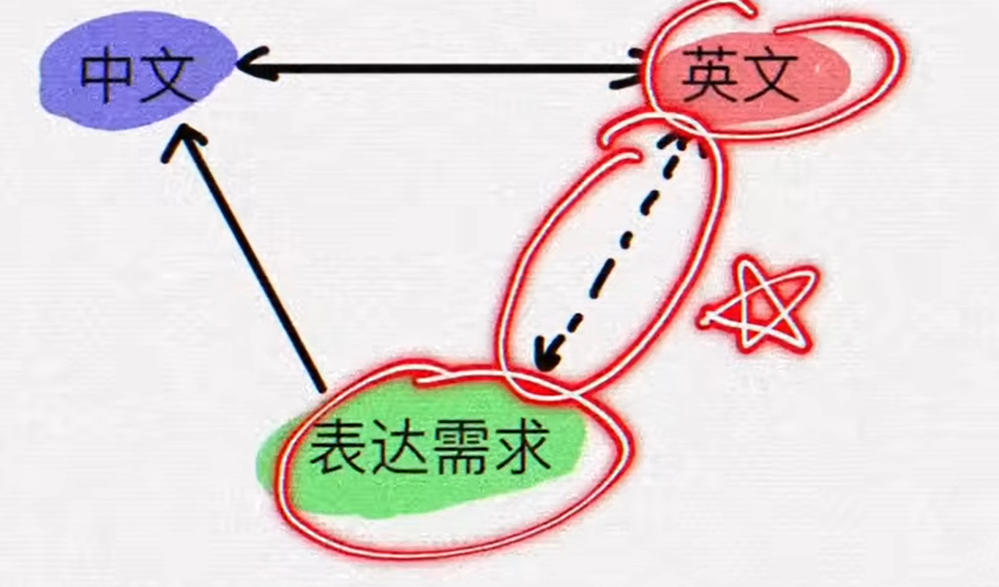

# Listen

停止去听清一个个单词，而是听懂一串短语或一句话，我们人最多可以记忆或处理四个单元的东西，如果你的一个单元仅仅只放一个单词，那么你就听了后面忘了前面，听不全一句话。如果你的一个单元放一个短语或半句话，那么你就可以听清。

# Speak

不要将中文翻译为英文，这本质还是中文表达习惯。而是要问这句话是在什么场景（语境）下，英语者更标准更常用的表达是什么。

很多人它词汇量很大，但是当他去开口讲英文的时候，他会发现在他自己的学习过程中，只做了记住这些单词是什么意思，而从来没有练习过如何地道的使用这些表达。

我们不要去练习翻译，我们要去练习脱口而出。当你看到某个语境，脑袋中马上要反应出对应的英文表达是什么？

