# Project Management

# 0 绪论

## 0.1 特性

项目是为了创造**独特**的 **产品、服务或成果（可交付性成果/可交付物）** 而进行的**临时性**工作。

特点：

- 独特性（带来不确定性），临时性（可交付物是持久的）
- 项目驱动组织变更
- 项目创造商业价值（有形无形价值）

项目集（Program）：项目之间有依赖关系

项目组合（Protfolio）：

## 项目生命周期

5大过程组，10大知识领域，49个过程

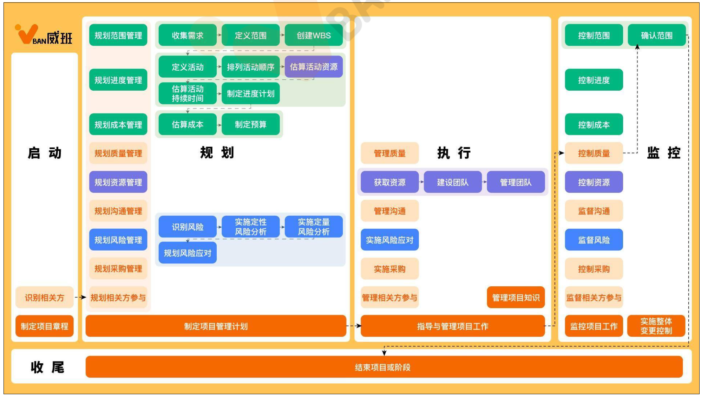

开发生命周期

5大过程组：启动，规划，执行，监控，收尾

预测型生命周期（瀑布型）：完全计划驱动型生命周期，对任何范围的变更都要进行仔细管理，有严格的变更流程

适用于：

1. 范围，进度，成本早期就可以定义
2. 有厚实的行业实践基础
3. 整批一次性交付产品有利于相关方

增量型生命周期

迭代型生命周期

适应型生命周期：较小增量，快速迭代

混合生命周期：预测 + 敏捷

10大知识领域：范围/进度/质量/成本（多快好省）管理，资源/采购/沟通（内外交）管理，整合/风险/相关方管理

ITTO：Input-Process-Tool-Output 输入→工具→过程→输出，每个过程的标准格式

职能型/矩阵型/项目型组织结构

项目常见角色：项目管理办公室（PMO），项目指导委员会（只针对某一个项目），项目经理，发起人（职权大于项目经理）

# 1 项目整合管理

## 1.1 制定项目章程过程

项目章程的作用：正式批准项目并授权项目经理在项目活动中使用组织资源

### 过程输入

1. 商业文件
   - 商业论证
   - 效益管理计划
2. 协议
3. 事业环境和组织过程资产

### 过程输出

1. 项目章程：

   - 包括的内容：

     - 项目的目的，目标，项目成功的标准，项目退出的标准

     - 范围：高层级需求，高层级项目描述，边界定义以及主要可交付成果；
     - 进度：总体里程碑进度计划
     - 成本：预先批准的财务资源
     - 整体项目风险，关键相关方名单
     - 委派的项目经理及其权责，发起人或其他批准项目章程的人员

2. 假设日志：记录整个项目周期中所有**假设条件和制约因素**

## 1.2 实施整体变更控制过程

审查所有变更请求、批准变更、管理变更、并对变更处理结果进行沟通的过程。

作用：确保对项目中已记录在案的变更做综合评审，从而降低项目风险。

重要概念

- CCB（Chang Control Board）：变更控制委员会

# 2 项目范围管理

项目范围管理包括确保项目**做且只做所需的全部工作**，以成功完成项目的各个过程。 

管理项目范围主要在于定义和控制哪些工作应该包括在项目内，哪些不应该包括在项目内。

范围包括：产品范围，项目范围

## 2.1 规划项目范围管理

是为记录如何定义、 确认和控制项目范围及产品范围， 而创建范围管理计划的过程。

ITTO

1. 输入
   - 项目章程
   - 项目管理计划
   3.	事业环境因素
   4.	组织过程资产
2. 工具与技术
   - 专家判断
   - 数据分析
   - 会议
3. 输出（两个how）
   - 范围管理计划：描述将如何定义、 制定、 监督、 控制和确认项目范围。
   - 需求管理计划：描述将如何分析、 记录和管理项目和产品需求
     - 上面两个**没有需求，没有范围**
     - 需求：需求来源于客户需要和期望的。
     - 范围：范围是满足 ＂需求“ 必须交付的可交付成果和相关工作， 用于确定项目边界。

## 2.2 收集需求

为实现目标而确定，记录并管理相关方的需要和需求的过程

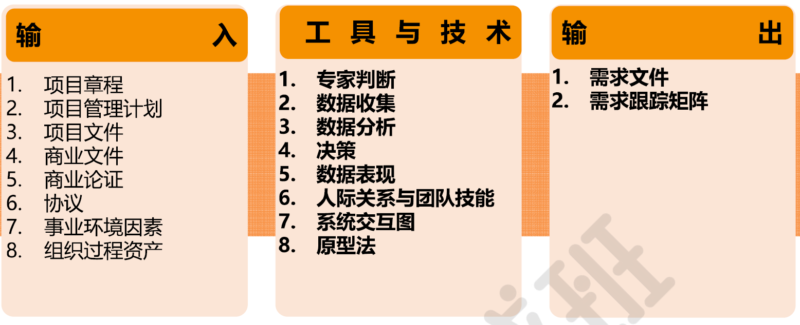

### 工具与技术

数据收集：

1. 头脑风暴
2. 访谈
3. 焦点小组：同领域专家们讨论
4. 问卷
5. 标杆对照

决策：

1. 投票：匿名征求专家建议-归纳-统计-匿名反馈-归纳-统计 循环
2. 独裁
3. 多标准决策

数据表现

1. 亲和图：按照自然属性归类分组
2. 思维导图
3. 人际关系与团队技能
   - 名义小组：多轮投票，排列
   - 观察与交谈：难以或不愿说明，挖掘需求
   - 引导协调：跨部门
4. 原型法

### 输出

1. **需求文件**：描述各种**单一需求**将如何满足与项目相关的**业务需求**
2. **需求跟踪矩阵**
   - 从 **需求来源** 到 **可交付成果**的 一种表格
   - 业务目标和项目目标联系起来，确保每个需求都具有商业价值
   - 正向跟踪，逆向跟踪
   - 

## 2.3 定义范围

制定项目和产品详细描述的过程

作用：描述产品，服务或成果的边界和验收标准。从需求文件中选取最终的项目需求，然后制定出关于项目及其产品，服务或成果的详细描述。

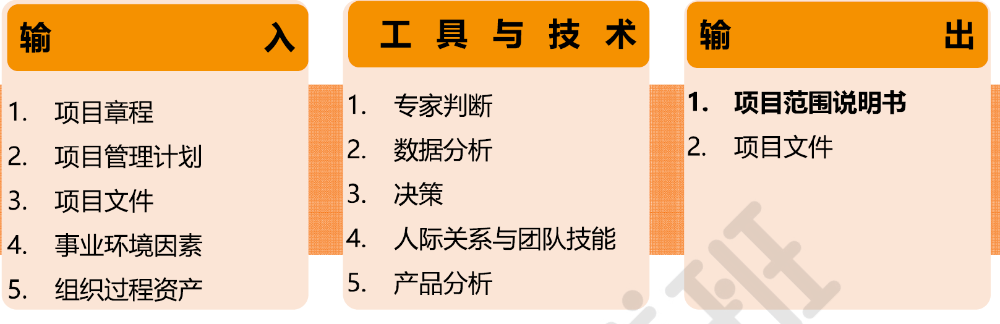

### 输出：项目范围说明书

项目范围说明书是对项目范围，主要可交付成果，假设条件和制约因素的描述，记录了整个范围，包括项目和产品范围

项目范围说明书代表了**项目相关方**之间就项目范围**所达成的共识**

包括：

1. 产品范围描述
2. 可交付成果
3. 验收标准
4. 除外责任

## 2.4 创建WBS

创建WBS（Work Breakdown Structure）-把项目可交付成果和项目工作分解成较小，更易于管理的组件（工作包）的过程

用树状的图去分解，**第一层**eg：“飞机系统”，多将项目生命周期各阶段or主要可交付成果作为分解的**第二层**

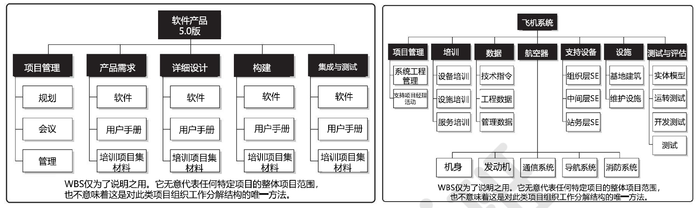

### 工具：分解

如何进行分解

4个主要原则：**100%原则，责任唯一原则**，80小时原则（建议），4~6层原则（建议）

### 输出：范围基准

范围基准-是经过批准的**范围说明书，WBS和相应的WBS词典**，只有经过正式的变更控制程序才能进行变更。

1. 范围说明书
   - 产品范围描述
   - 验收标准
   - 可交付成果
   - 项目的除外责任

2. WBS（工作分解结构）
   - 工作包
   - 规划包
   - **控制账户**：
     - 每个控制账户可能包含一个或多个工作包，一个工作包只能属于一个控制账户
     - 控制账户是一个管理控制点，在该控制点上，把范围、预算和进度加以整合，并于挣值进行比较
3. WBS 词典
   - 账户编码标志号
   - 工作描述
   - 负责的组织
   - 进度里程碑清单
   - 相关的进度活动
   - 所需的资源
   - 成本估算
   - 质量要求
   - 验收标准
   - 技术参考文献
   - 协议信息

## 2.5 确认范围

确认范围：“客户”或 发起人 正式验收已完成的项目可交付成果的过程

作用：通过验收每个可交付成果，提高最终产品，服务或成果验收的可能性。

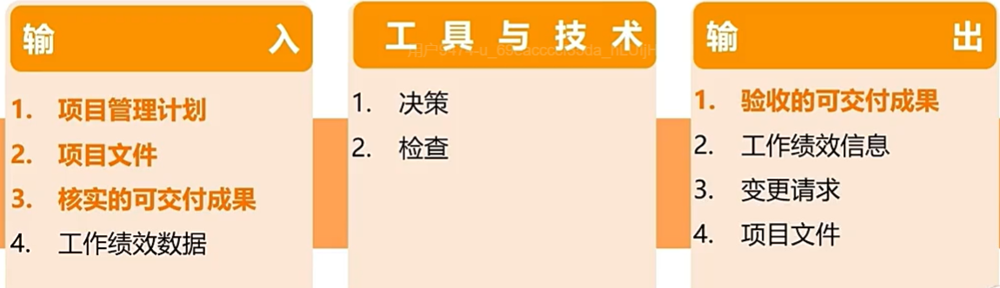

## 2.6 控制范围

控制范围-- 监督项目和产品的范围状态，**管理范围基准变更**的过程

作用：在整个项目期间保持对范围基准的维护，且需要在整个项目期间开展。

范围的变更，要严格走变更控制流程。

# 3 项目进度管理

## 3.1 规划进度管理

规划进度管理：为规划、编制、管理、执行和控制项目进度而制定的政策、程序和文档

作用：为如何在整个过程中管理项目进度提供指南和方向。

### 输出：进度管理计划

包含：

1. 项目进度模型制定和维护
2. 进度计划的发布和迭代长度
3. 准确度
4. 计量单位
5. 控制临界值
6. 绩效测量规则

## 3.2 定义活动

定义活动：识别和记录为完成过项目可交付成果而采取的具体行动

作用：将**工作包分解为进度活动**，作为项目工作进行进度估算，规划，执行，监督和控制的基础。

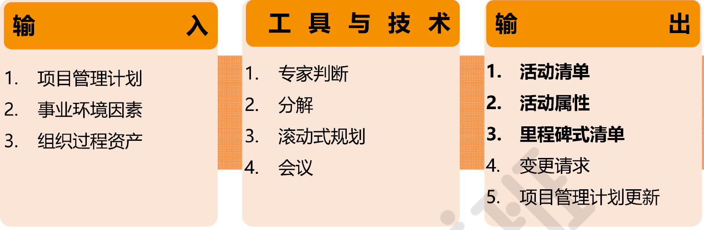

### 输出

活动清单：一份包含项目所需的全部进度活动的综合清单，活动是进度计划的组成部分，不是WBS的组成部分。

活动属性：指每项活动所具有的多种属性，扩展对活动的描述

里程碑清单

- 里程碑：项目中的重要时点（时间点）或事件，持续时间为0。
- 里程碑列出了所有里程碑，并指明里程碑是强制性的（如合同要求），还是选择性的

## 3.3 排列活动顺序

排列活动顺序：识别和记录项目活动间的逻辑关系。

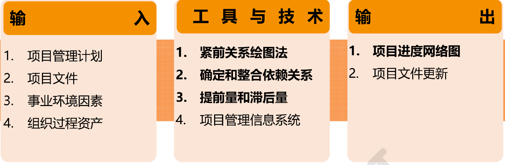

### TT

紧前关系4种逻辑关系

- **[完成 - 开始] Finish to Start（FS）**
  - 只有紧前活动完成，紧后活动才能开始
  - 最常用的逻辑关系
- **[开始 - 开始] Start to Start（SS）**
  - 只有紧前活动开始，紧后活动才能开始
- **[完成 - 完成] Finish to Finish（FF）**
  - 只有紧前活动完成，紧后活动才能完成
- **[开始 - 完成] Start to Finish（SF）**
  - 只有紧前活动开始，紧后活动才能完成

确定和整合依赖关系

- 强制性依赖关系：法律或合同所要求的，或工作的内在性质所决定的依赖关系，硬逻辑（hard logic）
- 选择性依赖关系：基于具体应用领域的最佳实践，或基于项目某些特殊性质，软逻辑（soft logic）
- 外部依赖关系：项目活动与非项目活动之间的依赖关系
- 内部依赖关系：项目活动之间的紧前关系
- 硬软，内外（项目内外）可两两组合

提前量：相对于紧前活动，紧后活动**可以提前**的时间量

滞后量：相对于紧前活动，紧后活动**必须推迟**的时间量

### output

**项目进度网络图**：表示项目进度活动之间的逻辑关系

- 带有多个紧前活动的活动代表**路径汇聚**
- 带有多个紧后活动的活动代表**路径分支**
- 带有汇聚和分支的活动，风险更高

## 3.4  估算活动持续时间

估算活动持续时间：根据**资源估算**的结果，估算完成**单项活动所需工作时段数**（工期）的过程。

考虑因素：

- 收益递减效应（边际效应）
- 资源数量：资源投入不一定能缩短工期
- 员工激励：估算时还要考虑deadline效应（学生综合征），帕金森定律（有意无意多做不必要的工作，范围蔓延，直到用完所有时间）

### TT

1. 类比估算
   - 使用相似活动或项目历史数据
   - 特点：专家判断，速度快，成本低，不太准确
2. 参数估算
   - 基于历史数据和项目参数，使用某种算法（模型）来计算成本或持续时间
   - 依赖参数模型，统计关系，套公式计算，取决于模型的成熟度和历史数据的准确性
3. 三点估算
   - 考虑估算中的不确定性和风险， 
   - 三点：最乐观，最悲观，最可能
   - **贝塔分布：预期值 = （最乐观 + 最可能 * 4 + 最悲观）/ 6**
   - 三角分布：预期值 = （最乐观 + 最可能 + 最悲观）/ 3
4. 自下而上估算
   - 自下而上，逐层汇总
5. 储备分析
   - 承认进度风险，应对进度方面的不确定性，确定项目所需的应急储备量和管理储备
   - 面对已知的已知风险，可以识别，主动应对
   - 面对 已知 的未知风险 —— 可以识别，不需要或没有办法主动处理，用**应急储备**，**包含在进度基准内，可直接使用**
   - 面对 未知的未知风险管理储备 ——无法识别，不需要或没有办法主动处理，用**管理储备**，使用前需要走变更流程，使用后，需要更新基准

### output

持续时间的估算和估算依据

## 3.5 制定进度计划

制定进度计划：是分析活动顺序，持续时间，资源需求和进度制约因素，创建进度模型，从而落实项目执行和监控的过程。

作用：为完成项目活动而制定具有计划日期的**进度模型**。

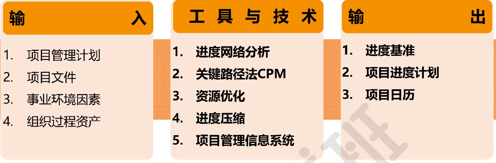

### TT

#### 进度网络分析

是创建项目进度模型的一种综合技术，整合了关键路径分析，资源优化，建模技术等

#### 关键路径法CPM

Critical Path Method，在进度模型中，估算项目最短工期。**关键路径是项目中时间最长的活动路径**，决定了可能的项目最短工期。

关键路径只考虑活动之间的逻辑顺序和依赖关系

七格图：每个活动用一个七格图表示，然后在项目进度网络图中进行分析

- 顺推找最大：找紧前活动最早结束时间的最大值
- 逆推找最小：找紧后活动最晚开始时间的最小值
- TF（Total Float）总浮动时间：这个活动延误，但不造成项目完工日期
- FF（Free Float）自由浮动时间：这个活动延误，在不延后任何紧后活动**最早开始日期**
- 关键路径的总浮动时间如果为**负值**，则代表活动进度落后了。

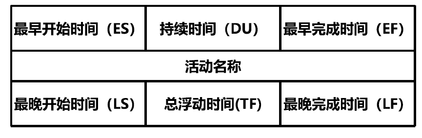

#### 资源优化

关键路径只考虑了活动之间的逻辑顺序和依赖关系，但没有考虑资源的分配情况。

资源优化是根据资源的供需情况，来调整进度模型的一个技术。包括**资源平衡和资源平滑**。

资源平衡：

- 为解决资源过载、资源分配不均，对活动进度进行调整（常改变关键路径），使资源使用趋于均衡。
- 特点：**通常会导致项目总工期延长**；多用于资源有限的场景。

资源平滑：

- 在**不改变项目总工期**、不调整活动逻辑关系的前提下，调整非关键路径活动的开始 / 结束时间，优化资源分配，削峰填谷。
- 特点：不会延长工期；资源可能仍存在过度负荷。

#### 进度压缩

进度压缩：在不缩减项目范围的前提下，缩短或加快进度工期，以满足进度制约因素，强制日期或其他进度目标。包括**赶工和快速跟进**

赶工

- 通过增加资源，以最小的成本增加来压缩进度工期（针对关键路径上的活动）
- 限制：花钱买时间，加人，加资源，加班
- 缺点：导致成本增加

快速跟进（不会增加资源成本）

- 按**顺序**进行的活动或阶段改为至少是部分**并行**开展
- 限制：只适用于**选择性依赖关系**的活动
- 缺点：导致返工的风险增加

### output

#### 进度基准

进度基准：经过批准的进度模型，只有通过正式的变更控制程序才能进行变更，用作与实际结果进行比较的依据

项目进度计划：进度模型的输出

- 形式：里程碑图，甘特图，详细进度计划

#### 项目日历

规定可以开展进度活动的可用工作日和工作班次

## 3.6 控制进度

控制进度：监督项目状态，更新项目进展，管理进度基准变更的过程

作用：整个项目期间保持对进度基准的维护

### TT

- 绩效审查
- 挣值分析
- 偏差分析
- 趋势分析
- 资源优化、提前量，滞后量、进度压缩，在进度落后的时候，可以考虑纠正的措施

# 4 项目成本管理

成本常见概念：

| 名称     | 概念                                                         | 例子                     |
| -------- | ------------------------------------------------------------ | ------------------------ |
| 直接成本 | 项目花掉的成本                                               | 人工费，材料费等         |
| 间接成本 | 在多个项目或者项目和运营之间分摊的成本                       | 管理费用、办公室租金     |
| 固定成本 | 不随生产量、工作量或时间的变化而变化的非重复成本             | 打印机、扫描仪等固定资产 |
| 可变成本 | 随着生产量、工作量或时间而变的成本                           | 原材料、人工费           |
| 沉没成本 | 任何已发生的成本，与是否合理无关。在决定是否继续某个出了问题的项目时，不应该考虑沉没成本。 | -                        |
| 机会成本 | 因为选择一个项目而放弃另一个项目，另一个项目可能带来的最大利益 | -                        |

| 名称                                        | 定义                                                         | 决策标准                                       |
| ------------------------------------------- | ------------------------------------------------------------ | ---------------------------------------------- |
| 现值 PV 和终值 FV                           | 考虑货币的**时间价值**                                       | -                                              |
| 净现值 NPV Net Present Value           | 收入的现值减去支出的现值                                     | NPV 越大越好NPV>0 项目能接受NPV<0 项目不能接受 |
| 效益成本比 BCR Benefit-Cost Ratio      | 类似于成本效益分析，项目的效益与成本之比                     | BCR 越大越好收益成本率大于 1 的项目才是值得做  |
| 投资回报率 ROI Return on Investment    | 项目产品运行所产生的年均利润与项目投资额之比                 | 投资回报率越高越好                             |
| 投资回收期 PP Payback Period           | 项目建设期加上项目投产后累计运营利润等于投资金额所需要的时间 | 投资回收期越短越好                             |
| 内部报酬率 IRR Internal Rate of Return | 项目现金流入量现值等于现金流出量现值时折现率                 | 内部报酬率越高越好                             |

## 4.1 规划成本管理

规划成本管理：确定如何估算，预算，管理，监督和控制项目成本的过程

作用：在整个项目期间为如何管理项目成本提供指南和方向

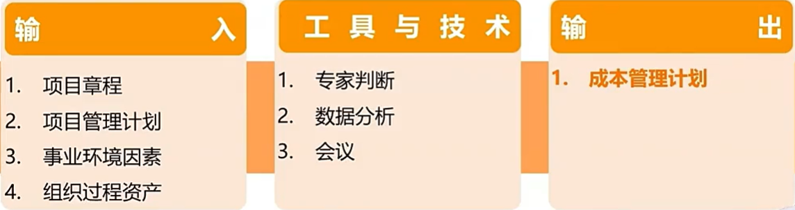

成本管理计划：描述将如何规划、安排和控制项目成本（无成本）

包含：

- 计量单位
- 精确度
- 准确度
- 控制临界值
- 绩效测量规则
- 报告格式

## 4.2 估算成本

估算成本：对完成整个项目工作所需成本进行近似估算的过程

作用：确定项目所需的资金

在项目生命周期中，项目估算的准确性将随着项目的进展而逐步提高

粗略量级的估算（ROM，-25%~+75%）：在启动阶段进行估算

确定性估算（-5%~+10%）：在规划阶段后期进行的估算

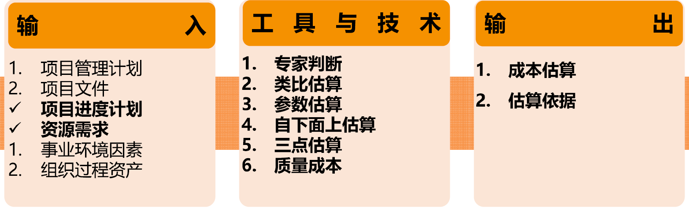

### TT

| 工具种类     | 定义                                                         | 关键词                                                       |
| ------------ | ------------------------------------------------------------ | ------------------------------------------------------------ |
| 类比估算     | ✓ 使用相似活动或项目的历史数据，来估算当前活动或项目的持续时间或成本 的技术✓ 是一种粗略的估算方法，也是一种专家判断法 ✓ 类比估算通常成本较低、耗时较少，但准确性也较低 | 是一种专家判断，参照过去的数据，整体直接估算，速度快，成本低 |
| 参数估算     | ✓ 基于历史数据和项目参数，使用某种算法来计算成本或持续时间 ✓ 参数估算的准确性取决于参数模型的成熟度和基础数据的可靠性 | 依赖于参数模型、统计关系和历史数据，套公式计算               |
| 三点估算     | 考虑估算中的不确定性和风险，可以提高活动持续时间估算的准确性，有计算公式 | 考虑风险和不确定性                                           |
| 自下而上估算 | 从下到上逐层汇总 WBS 组成部分的估算而得到项目估算            | 自下而上，逐层汇总                                           |
| 储备分析     | 应急储备（已知 — 未知风险）、管理储备（未知 — 未知风险）     | 已知还是未知风险                                             |
| 质量成本     | 包括一致性和非一致性成本（后续质量管理章节会详细讲解）       | -                                                            |

## 4.3 制定预算

制定预算：汇总所有单个活动或工作包的估算成本，建立一个经批准的成本基准的过程。

作用：确定成本基准，可据此监督和控制项目绩效

成本基准是经过批准且按时间段分配的项目预算，包括应急储备，但不包括管理储备

**项目总预算 = 成本基准 + 管理储备**

### TT

- 成本汇总
- 储备分析
- 历史信息审核
- 资金限制平衡

### output

成本基准：是经过批准且按时间段分配的项目预算，包括应急储备，但不包括管理储备

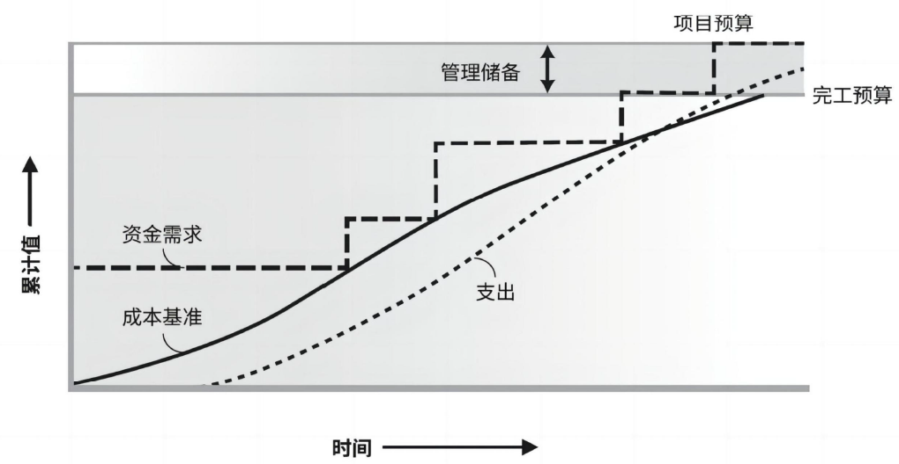

## 4.4 控制成本

控制成本：监督项目状态，以更新项目成本，管理成本基准变更的过程

作用：在整个项目期间保持对成本基准的维护

### TT

挣值管理（EVM）Earned Value

- 将范围，进度和资源测量值综合起来，以评估项目绩效和进展的方法
- 挣值分析：PV计划价值，EV挣值，AC实际成本，BAC完工预算
- 偏差分析：SV进度偏差，CV成本偏差，SPI进度绩效指数，CPI成本绩效指数
- 趋势分析：ETC完工尚需估算，EAC完工估算

英文全称：

- PV：Planned Value 计划价值，EV：Earned Value 挣值，AC：Actual Cost 实际成本，BAC：Budget At Completion 完工预算
- SV：Schedule Variance 进度偏差，CV：Cost Variance 成本偏差，SPI：Schedule Performance Index 进度绩效指数，CPI：Cost Performance Index 成本绩效指数
- ETC：Estimate To Complete 完工尚需估算，EAC：Estimate At Completion 完工估算

#### 挣值分析

计划价值（PV：Planned Value）

- 截至某个时间点，计划要完成的工作价值
- PV = 计划要完成的工作量 * 预算单价
- 项目总的计划价值——**完工预算BAC（**= 成本基准）

挣值（EV：Earned Value）

- 截至某个时间点，实际完成的工作价值
- EV =  实际已完成的工作量 * 预算单价
- EV应与已完成的工作内容相对应

实际成本（AC：Actual Cost）

- 截至某个时间点，实际已完成工作的实际成本
- AC = 实际已完成的工作量 * 实际单价

#### 偏差分析法

进度偏差（SV：Schedule Variance）

- 衡量项目进度绩效，表明目前的项目进度时提前还是滞后 SV = EV - PV

成本偏差（CV：Cost Variance）

- 衡量项目成本绩效，表明目前的项目成本是超支还是结余CV = EV - AC
- 项目结束时的成本偏差，就是BAC与实际总成本之间的差值

把 SV 和 CV 转化为效率指标，以便把项目的成本和进度绩效与任何其他项目作比较，或在同一项目组合内的各项目之间进行比较

- 进度绩效指数 (Schedule Performance Index, SPI)
  - 说明项目团队的时间利用效率，SPI = EV / PV 
- 成本绩效指数 (Cost Performance Index, CPI)
  - 考核已完成工作的成本效率，CPI = EV / AC

#### 趋势分析

**完工尚需估算 ETC (Estimate to Complete)**：

- 完成所有剩余项目工作的预计成本。

**完工估算 EAC (Estimate at Completion)**：

- 完成所有工作所需的预期总成本。

**基础公式**：

- EAC=AC+ETC=AC+(BAC−EV)/CPI

不同偏差场景的计算方式：

- 非典型偏差：当前的成本偏差在以后不会发生，CPI=1，带入基础公式
  - EAC=AC+BAC−EV
- 典型偏差：当前的成本偏差代表未来偏差，CPI保持不变，带入基础公式
  -  EAC=AC+BAC/CPI−EV/CPI=BAC/CPI
- 剩余工作同时受CPI和SPI的影响，关键比率：CR = CPI * SPI
  - EAC=AC+(BAC−EV)/(CPI * SPI)
- 注：BAC−EV表示剩余工作的预算价值

完工偏差：VAC = BAC - EAC

完工尚需绩效指数（TCPI：To-Complete Performance Index）

- 指为了实现具体的管理目标（如BAC 或EAC），完成剩余工作所需成本与剩余预算之比
- TCPI = 剩下工作所需要付的钱 / 口袋里还剩的钱

# 5 项目质量管理

质量管理大师

- 戴明
  - **PDCA**（Plan-Do-Check-Action）环
  - 质量管理14条原则（预防胜于检查，85/15原则，持续改进）
- 朱兰：强调质量是适合的，提出使用质量与等级的区别
- 鲁克斯比：
  - 强调质量是符合要求
  - 质量是免费的（减少返工，可以抵消成本）
  - 零缺陷，第一次就把事情做对
- 石川磬：鱼骨图
- 田口玄一：质量损失函数，提出实验设计方法

质量管理概念

- 质量：作为实现的性能或成果，是一系列内在特性满足要求的程度
- 等级：作为设计意图，是对用途相同但技术特性不同的可交付成果的级别分类
- 高等级 ≠ 高质量，低等级 ≠ 低质量，质量水平未到达质量要求肯定是一个问题，低等级不一定是问题。

质量管理的五个层次：

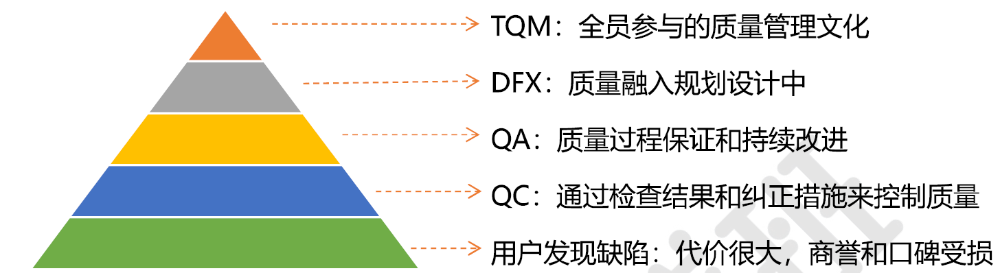

## 5.1 规划质量管理

规划质量管理：识别项目及其可交付成果的质量要求和（或）标准，并书面描述项目将如何证明符合质量要求和（或）标准的过程

作用：为在整个项目期间**如何管理质量和核实质量**提供指南和方向。

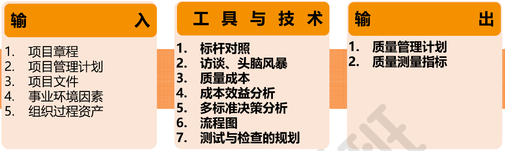

### TT

成本效益分析：了解不同质量管理方案或质量标准所需要的成本和能产出的效益

质量成本：为达到可交付成果的质量标准而付出的成本，不包含生产成本

一致性成本：花钱规避失败

- 预防成本

非一致性成本：由于失败花费的成本

- 内部失败成本
- 外部失败成本

流程图：在流程中，添加质量管理

### output

质量管理计划：描述如何实施适用政策、程序和指南以实现质量目标

- 项目采用的质量标准，项目的质量标准
- 质量角色和职责
- 怎么去做QC和QA

质量测量指标：具体的测量指标

## 5.2 管理质量

管理质量：把组织的质量政策用于项目，并将质量计划转化为可执行的质量活动的过程

作用： 提高实现质量目标的可能性，以及识别无效过程和导致质量低劣的原因

管理质量的工作属于质量成本框架中的一致性成本。

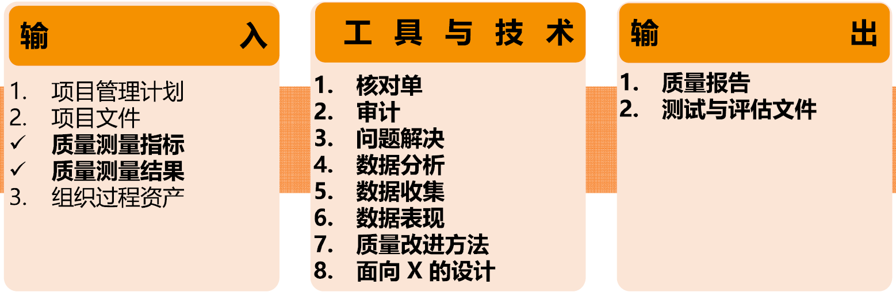

### TT

质量审计

- 用来确定项目活动是否遵循了组织和项目政策，过程与程序的一种结构化的独立过程
- 审计形式：通常由项目外部的团队开展（内审，外审，事先安排，随机进行）

数据表现

- 鱼骨图（因果图）
- 5个why分析法

# 6 项目沟通管理

沟通：通过沟通活动（如会议和演讲），或以工件的方式（如email，社交媒体，项目报告，项目文档）等各种可能的方式来发送或者接收信息（**信息流的传递**）

成功的沟通由两部分组成：

- 项目及其相关方需求而制定适当的沟通策略
- 从该策略出发，制定沟通管理计划，来确保用各种方式和手段把恰当的信息传递给相关方

## 6.1 规划沟通管理

规划沟通管理：基于每个相关方或相关方群体的信息需求、可用的组织资产，以及具体项目的需求，为项目沟通活动制定恰当的方法和计划的过程。

作用：为及时向相关方提供相关信息，引导相关方有效参与项目，而编制书面沟通计划。

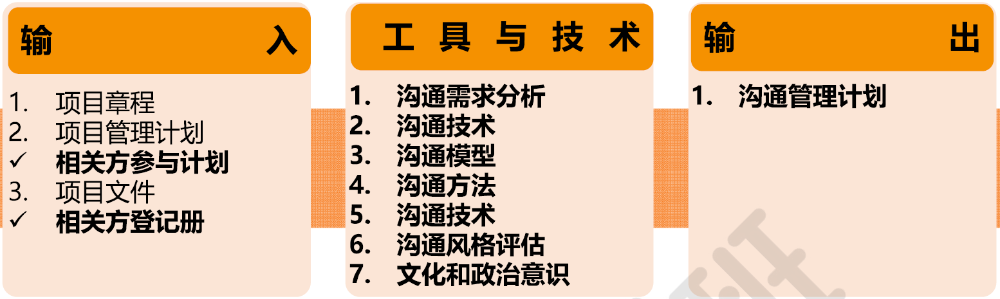

# 7 项目风险管理

项目风险：是一种不确定的事件或条件，一旦发生，就会对一个或多个项目目标造成**积极或消极**的影响，

风险的三要素：风险事件，概率，影响（**时间，成本，质量**）

项目存在两个层面的风险

- 单个项目风险
- 整体项目风险：所有单个风险之和对项目整体的影响，项目整体风险要大于所有单个项目风险之和（风险之间可能会相互影响）

风险态度：指干系人对风险所采取的态度，分为**风险厌恶者，风险中立者，风险激进者**

风险临界值：度，超过了这个度就需要干预，低于则可以接受

三种性质的风险

- 已知-已知风险：制定主动的应对措施
- 已知-未知风险：应急储备，已识别但无法预计工作量和主动管理的风险
- 未知-未知风险：管理储备

## 7.1 规划项目风险管理

规划风险管理：定义如何实施项目风险管理活动的过程

作用：确保风险管理的水平，方法和可见度与项目风险程度，及项目对组织和其他相关方的重要程度相匹配

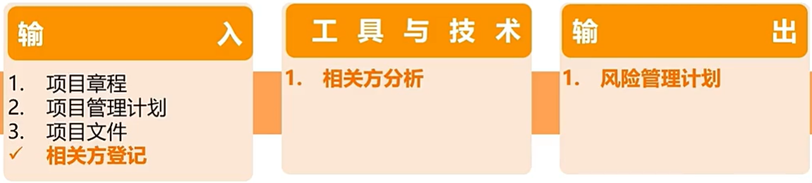

相关方分析：通过相关方分析确定项目相关方的风险偏好

### output

风险管理计划，包括

- 角色与职责：确定每项风险管理活动的领导者，支持者和团队成员，并明确他们的职责
- 相关方风险偏好：应针对每个项目目标，把相关方的风险偏好表述成可测量的风险临界值
- 风险类别：确定对单个风险项目进行分类的方法，通常借助风险分解结构（RBS）来构建风险类别（识别风险工具）
- 风险概率和影响的定义：自行制定关于概率和影响级别的具体定义，或者用组织提供的通用定义作为出发点。（定性风险分析工具）
- 概率和影响矩阵：概率和影响可以用描述性语言或数值来表达

## 7.2 识别风险

识别风险：识别单个项目风险以及整体项目风险的来源，并记录风险特征的过程

作用：记录现有的单个项目风险，以及整体项目风险的来源

鼓励所有项目相关方参与单个项目风险的识别工作

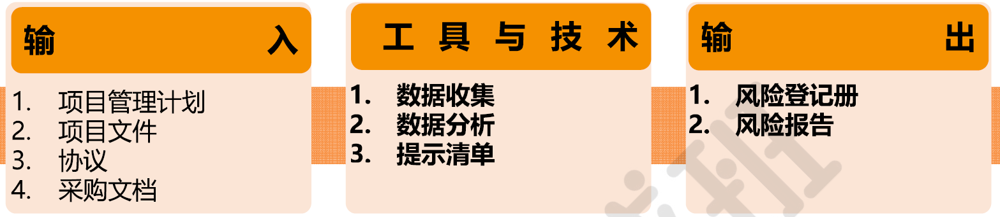

## 7.3 实施定性风险分析

实施定性风险分析：评估单个项目风险发生的**概率和影响**以及其他特征，**对风险进行优先级排序**

作用：**重点关注高优先级风险**

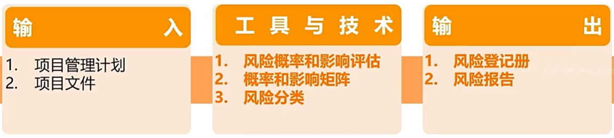

## 7.4 实施定量风险分析

实施定量风险分析：就已识别的单个项目风险和不确定性的其他来源对整体项目的影响进行定量分析的过程

作用：量化整体项目**风险敞口（=概率 * 影响）**，并提供额外的定量风险信息，以支持风险应对规划

**并非所有项目都需要实施定量风险分析**：适用于大型或复杂项目，具有战略重要性的项目，合同或相关方有要求分析项目。

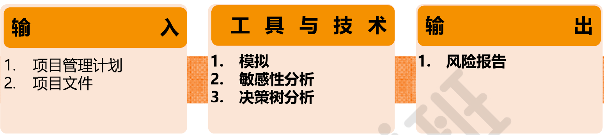

### TT

- 模拟：蒙特卡洛分析（计算机）
- 敏感性分析：龙卷风图（多因素固定于基准，然后控制变量法）
- 决策树分析法：用决策树在若干备选行动中选择一个最佳方案，在分析中，通过计算每条分支的预期货币价值（EMV），就可以选出最有路径

# 8 项目资源管理

**激励模型**

马斯诺需求层次理论

- 生理需求，安全需求，社交需求，尊重需求，自我实现
- 了解团队成员处于哪一种需求层次，针对需求层次，进行激励

赫茨伯格双因素理论

- 有两类因素：保健因素和激励因素，决定人的行为
- 保健因素：导致不满足感的因素，做的好不会提高激励，做的不好就会损害激励（相当于马斯诺低需求层次：生理，安全，社交）
- 激励因素：导致满足感的因素，能够真正起激励作用的（相当于马斯洛高需求层次）

麦克利兰成就动机理论（需要理论）

- 所有人都是由成就需要，权力需要和归属需要驱动的
- 成就，受成就激励的人，能被有挑战性但合理性的活动和工作所激励
- 权力，受权力激励的人喜欢组织，激励和领导他人。他们被增加的职责所激励
- 归属，受归属激励的人会寻求认可和归属感，他们能被团队一员所激励

麦克雷戈

- X理论：人性本惰论，认为人总是消极懒惰，缺乏进取心，总是逃避责任。X理论认为只能使用低层次需求进行激励
- Y理论：人性本善论，认为人总是积极的，愿意进步，愿意承担责任。Y理论认为人更应该使用高层次需求进行激励

威廉大内

- Z理论：终身雇佣，缓慢的评价和晋升，让员工得到多方面的锻炼

**情景领导力模型**

情景领导理论

- 主要关注的是在具体情境中的领导行为。

- 要求领导者的风格与下属的胜任力和承诺水平相吻合。
- 有效的领导者可以认识到员工不同的需求，并改变自己的领导风格来满足员工的需求。

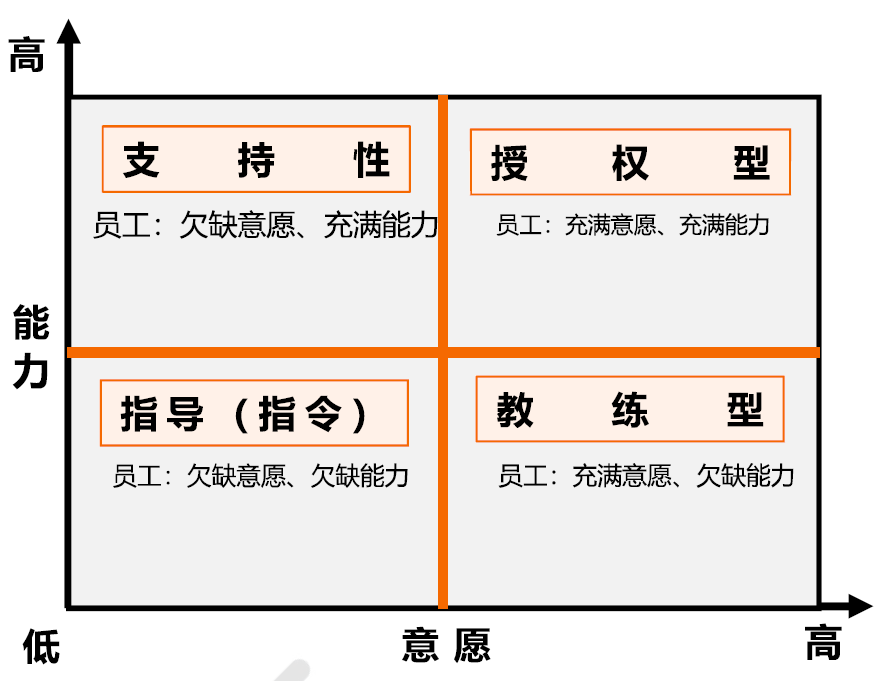

## 8.1 规划资源管理

规划资源管理：定义如何估算，获取，管理和利用团队以及实物资源的过程

作用：根据项目类型和复杂程度确定适用于项目资源的管理方法和管理程度。

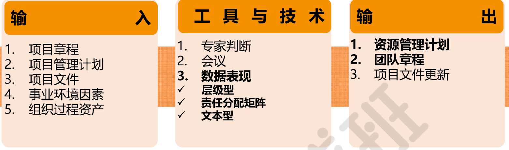

### TT

数据表现

- 数据表现格式：层级型，矩阵型，文本型
- 无论使用哪种格式，目的都是确保每个工作包都有明确的责任人，确保团队人员都清楚地理解其角色和职责。
- 可用于表现高层级角色，文本型更适合用于记录详细职责
- 层级型：可采用传统的组织结构图（**工作WBS，组织OBS，资源RBS**），自上而下地显示各种职位及其相互关系
- **责任分配矩阵（RAM）**：展示项目资源在各个工作包中的任务分配 ，避免责任不清
  - 高层次RAM可定义项目团队，小组或部门负责WBS中的哪部分内容
  - 低层次RAM可在各小组内为具体活动分配角色，职责和职权
  - 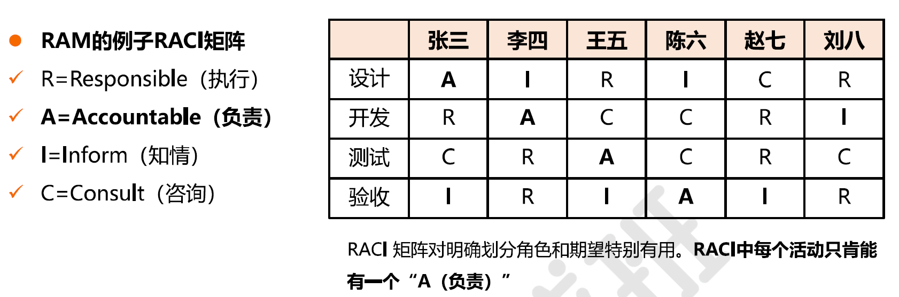
  - 

### output

**资源管理计划**

- 提供了关于如何分类，分配，管理和释放项目资源的指南
- 项目团队资源管理：如何定义，配备，管理和最终遣散项目团队资源的指南
  - 识别资源
  - 获取资源
- 角色与职责
  - 角色，职权，职责，能力
- 如何建设团队
  - 培训
  - 团队建设
  - 认可计划：激励
- 项目组织图

团队章程

- 为团队创造团队价值观，共识和工作指南的文件（基本规则）。
- 减少误解，提高生产力
- **团队章程最好由团队自身制定或参与制定，这样可发挥最佳效果**

## 8.2 估算活动资源

估算活动资源：估算执行项目所需的团队资源，以及材料，设备和用品的类型和数量的过程

作用：明确完成项目所需的资源种类，数量和特性。估算活动资源过程与估算成本过程紧密相关

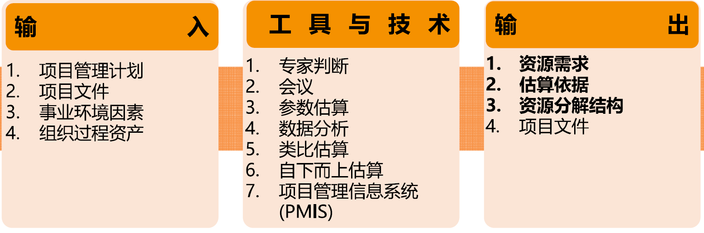

### output

1. 资源需求 -- 识别了各个工作包或工作包中每个活动所需的资源类型、可用性、所需数量。
2. 估算依据 -- 支持性文件，清晰完整地说明资源估算是如何得出的。
3. 资源分解结构（RBS）-- 资源依类别和类型的层级展现

## 8.3 获取资源

获取资源：获取项目所需的团队成员、设施、设备、材料、用品和其他资源的过程。

作用：概述和指导资源的选择，并将其分配给相应的活动。

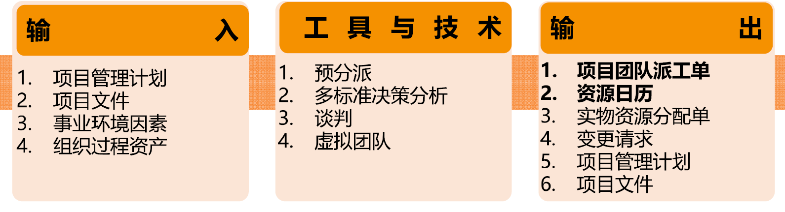

### TT

预分派：事先确定项目的实物或团队资源

多标准决策分析：制定多标准，标准加权重，打分筛选可适用的资源

谈判/协商：

- 谈判协商的对象：职能经理，其他项目管理团队，供应商

虚拟团队：具有共同目标，在完成角色任务过程中，很少或没有时间面对面工作的一帮人。最大的问题是沟通，优点节约成本

### output

项目团队派工单：记录了团队成员及其在项目中的角色和职责，可包括项目团队名录

资源日历

## 8.4 建设团队

团队的发展经过的阶段模型（塔克曼模型）

- 形成阶段：相互认识，相互独立，不一定坦诚
- 震荡阶段：冲突，矛盾，观点意见
- 规范阶段：协同工作，，相互信任
- 成熟阶段：组织有序，相互依靠，高效
- 解散阶段：释放人员，解散团队
- 这些阶段可进可退，可跳可停

**建设团队**：是提高工作能力，促进团队成员互动，改善团队整体氛围，以提高项目绩效的过程。

**作用**：改进团队协作，增强人际关系技能，激励员工，减少摩擦，提升整体项目绩效。

目标：

- 提升团队成员知识和技能
- 提高团队成员之间的信任和认同感
- 创建富有生气，凝聚力和协作的团队文化
- 提高团队参与决策能力，使他们承担起对解决方案的责任

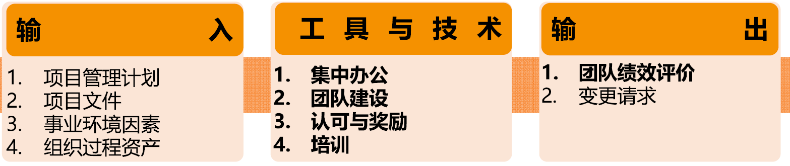

### TT

认可与奖励

- 只有能满足被奖励者的某个重要需求的奖励，才是最有效的奖励（按需奖励）
- 及时奖励

培训

- 作用：提高项目团队成员能力，减少成员之间的差异的全部活动

个人与团队评估

- 让项目经理洞察团队成员的优势和劣势，评估他们的偏好和愿望。

### output

团队绩效评价

- 评价能使团队识别出所需的技能，教练，辅导，协助或改变，以提高绩效
- 评价团队有效性的指标：
  - 个人能力
  - 团队能力
  - 团队成员离职率
  - 团队凝聚力

## 8.5 管理团队

**管理团队**：跟踪团队成员工作表现，提供反馈，解决问题并管理团队变更，以优化项目绩效的过程。

**本过程的作用**：影响团队行为、管理冲突以及解决问题。

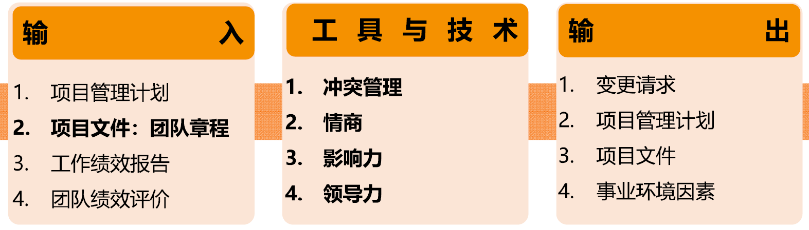

### TT

冲突管理

- 冲突来源：资源稀缺性，任务优先级差异，个人工作风格，性格
- 解决步骤：
  1. 项目成员自行解决
  2. 升级，项目经理协助
  3. 冲突继续存在，适用正式程序，包括惩戒
- 解决方法
  - 撤退/回避：退出冲突，将问题推迟或推给他人解决
  - 缓和/包容：强调一致而非差异，考虑其他方的需要（求同存异）
  - 妥协/调解：为了暂时或部分解决冲突，寻找各方都在一定程度上满意的方案（部分解决）
  - 强迫/命令：解决紧急问题
  - 合作/解决：综合各方观点，采用合作态度和开放式对话

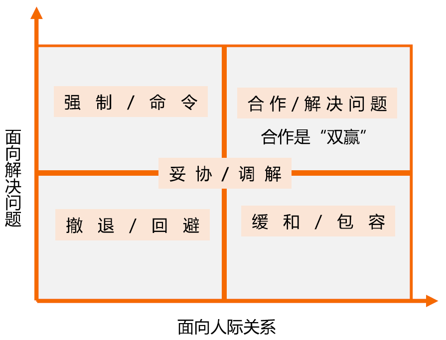

人际关系和团队技能

- 情商：识别，评估，管理情绪的能力（个人，他人，团队）
- 影响力：说服他人，清晰表达立场和观点，有效倾听，收集相关信息
- 领导力：领导团队，激励团队做好本职工作的能力

## 8.6 控制资源

**控制资源**：是确保按计划为项目分配实物资源，以及根据资源使用计划监督资源实际使用情况，并采取必要纠正措施的过程。

**本过程的作用**：确保所分配的资源适时适地可用于项目，且在不再需要时被释放。

# 敏捷管理

## 4大宣言12大原则

4大宣言12大原则多个实践框架

- 4大宣言：左边的价值 大于 右侧的价值
  - 个体以及互动而不是过程和工具（强调人）
  - 可用的软件而不是完整的文档（价值交付）
  - 客户合作而不是合同谈判（人）
  - 应对变更而不是遵循计划（价值交付）
- 12大原则：
  1. **持续交付价值**：最高目标是尽早、持续交付有价值软件，满足客户需求。
  2. **拥抱需求变更**：欢迎任何阶段的需求变更，借助变更帮客户打造市场竞争优势。
  3. **短周期交付可用软件**：频繁交付可用软件，交付周期尽量缩短（几周优先于数月）。
  4. **业务与开发日常协作**：项目全程，业务方和开发人员紧密协同办公。
  5. **激励赋能团队成员**：激励项目人员，提供环境、资源支持，信任团队自主完成工作。
  6. **面对面高效沟通**：团队内外，面对面交流是信息传递效率最高的方式。
  7. **可用软件作为进度标尺**：**可用的软件**是衡量项目进度的首要指标。
  8. **可持续开发节奏**：发起人、开发、用户长期保持稳定匀速的开发节奏。
  9. **精进技术优化设计**：持续打磨技术、优化架构设计，提升敏捷应变能力。
  10. **精简冗余工作**：最大限度削减无效、多余工作，追求简洁。
  11. **自组织团队产出优质方案**：最优架构、需求、设计，来源于自组织团队。
  12. **定期复盘优化**：团队周期性复盘工作效率，主动调整改进工作方式。

价值交付：1、2、4、7（及早，持续不断，短周期交付有价值的软件）

人员：4，5，6，8，11，12（提供信任环境，团队内外不断互动，团队自动自发工作，有问题定期反思）

过程：9，10（不断追求更好的技术，不多做无用功）

## 敏捷项目和敏捷团队章程

项目章程

- 项目愿景：为什么要做这个项目
- 项目目标：谁获益，如何受益
- 发布标准：DOD
- 预期工作流：我们怎样合作

团队章程

- 创建一个敏捷环境，发挥团队成员最大能力
- 团队价值观
- 工作协议：eg：就绪定义，完成的定义
- 基本规则
- 团队规范

## SCRUM

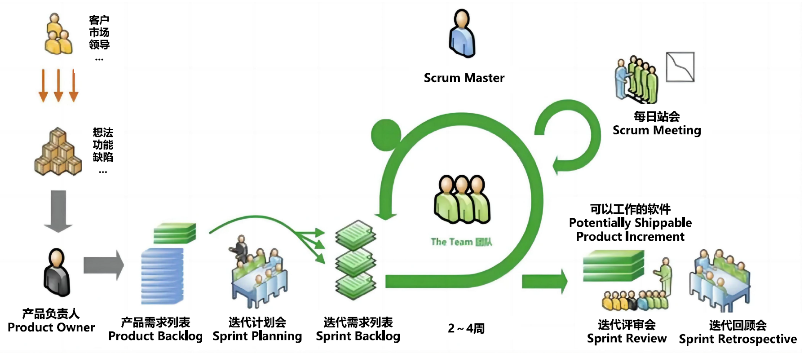

三个角色：

1. 产品负责人（PO）
2. 开发团队：专职团队，团队工作场所（集中或分布式），克服组织孤岛
3. 敏捷教练SCRUM Master（PM）：仆人型

三个工件：

1. 产品待办事项列表（Product Backlog）：
   - 用户故事编写时，遵循Invest原则，
   - 探针
   - DOR（Definition of Ready）满足准备就绪定义，需求准入标准（用户故事被开发团队接受并进入开发）。
   - 用户故事优先级排序
     - MoSCoW（Must Shoud Could Won‘t ）
     - 风险价值矩阵：高价值高风险首先做，高价值低风险其次做，低价值低风险最后做，低价值高风险不做
2. 冲刺代办事项列表（Sprint Backlog）
3. 产品增量（Product Increment）
   - 满足DoD（Definition of Done）

五个事件（PDCA）

1. Sprint：冲刺or迭代
2. Sprint规划会议（P，Plan）：
   - 故事点：相对估计，亲和估算，计划扑克估算
   - 团队速率：5~6个迭代才能知道整个团队相对稳定的速率
3. 每日站会（D，Do）：
   - 做了什么，还要做什么，有什么风险，会上只提出问题，不分析和解决。会后跟踪问题。
   - 会议输出：
     - 信息发射源的更新：燃尽/燃起图（迭代内），挣值管理图（SPI进度绩效指数和CPI成本绩效指数），累计流量图（不同阶段工作量的累积）
     - 障碍问题的跟进
4. 冲刺评审会议（C，Check）：检视所交付的产品增量并按需调整产品代办列表
5. 冲刺回顾会议（A，Act）：检视自身创建下一个Sprint
6. 迭代计划 (P)→迭代开发 (D)→评审验收 (C)→回顾改进 (A)

五个价值观：承诺，专注，开放，尊重，勇气

## 看板管理

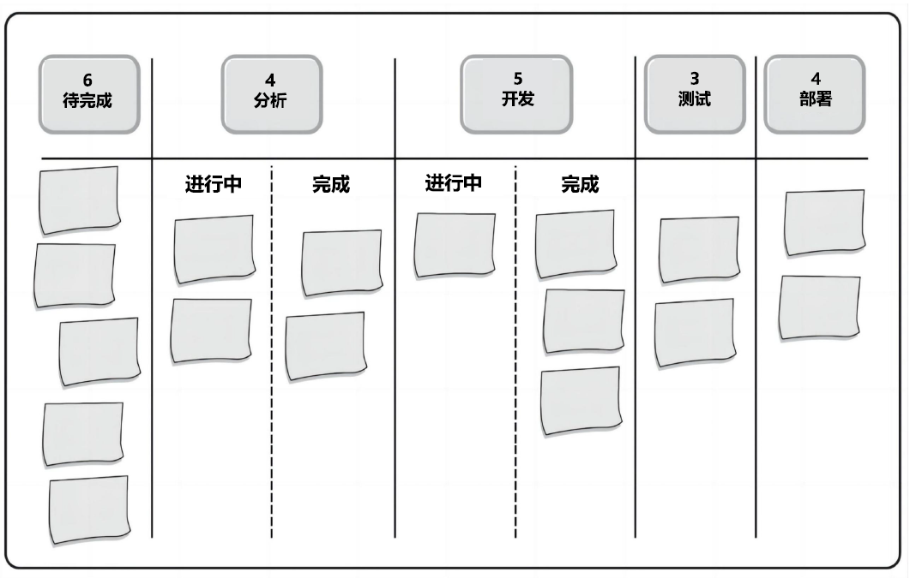

看板

- 一个由列和卡片组成的面板
- 每列代表工作流程的一个阶段
- 每个卡片则表示这个阶段内需要完成的具体任务

任务板

- 细分项目中的任务，分配给团队成员

看板管理的作用

1. 可视化工作流程
2. 限制WIP（work in progress）
3. 管理和改进流程

## 极限编程

是一种敏捷软件开发方法，主要关注软件开发的效率和客户满意度。

特点：快速迭代，频繁交付，持续测试，持续集成，测试驱动开发

## 其他概念

最小可行性产品：

- 快速构建符合产品功能的最小功能集合。
- 当客户无法明确确定需求，可以构建初步产品原型，通过反馈和修正，最终满足客户需求。

# 管理原则和绩效域

## 项目管理的12条原则

1. 成为勤勉、尊重和关心他人的管家。
2. 营造协作的项目团队环境。
3. 有效地管理干系人参与。
4. 聚焦于价值。
5. 识别、评估和响应系统交互。
6. 展现领导力行为。
7. 根据环境进行裁剪。
8. 将质量融入到过程和可交付物中。
9. 驾驭复杂性。
10. 优化风险应对。
11. 拥抱适应性和韧性。
12. 为实现预期的未来状态而驱动变革。

关于人：1，2，3，6

关于项目目标：4，12

关于过程：剩余

## 8个绩效域

项目绩效域：是一组对有效地交付项目成果至关重要的相关活动

在项目管理的原则下，知道我们绩效域的行为

- 干系人
- 团队
- 开发方法和生命周期（启动）
- 规划（规划）
- 项目工作（执行）
- 交付（收尾）
- 测量（监控）
- 不确定性

# 术语

产品负责人（PO）：Product Owner